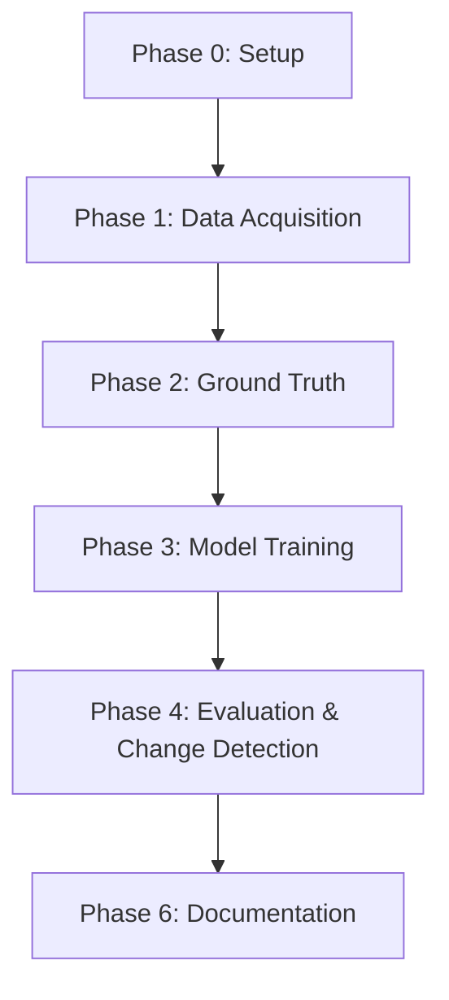

# IKN Built-Up Area Change Detection: Implementation Plan
## Phase-Based Workflow (1 Month Timeline)

> **Project Goal**: Detect and quantify built-up area changes in IKN (Ibu Kota Nusantara) between 2023/2024 and 2025 using Sentinel-2 imagery, Random Forest classification, and interactive WebGIS visualization.

---

## 📅 Timeline Overview

| Phase | Duration | Key Deliverables | Gate Criteria |
|:------|:---------|:----------------|:--------------|
| **Phase 0**: Project Setup | Week 1 (Days 1-2) | GitHub repo, GEE setup, IKN boundary | Repository accessible, boundary validated |
| **Phase 1**: Data Acquisition | Week 1 (Days 3-7) | Sentinel-2 composites (2023/24 & 2025) | Cloud-free composites exported |
| **Phase 2**: Ground Truth | Week 2 (Days 8-12) | 300+ labeled points | Balanced classes, spatial distribution |
| **Phase 3**: Model Training | Week 2-3 (Days 13-17) | Trained RF model, classifications | APRF metrics calculated |
| **Phase 4**: Change Detection | Week 3 (Days 18-21) | GeoJSON polygons (Gain/Loss) | Vectorization complete |
| **Phase 5**: WebGIS Development | Week 3-4 (Days 19-26) | 4-tab interactive WebGIS | All tabs functional |
| **Phase 6**: Documentation | Week 4 (Days 27-30) | PDF report, README, presentation | Submission-ready package |

---

## Phase 0: Project Setup & Infrastructure
**Duration**: Week 1, Days 1-2 (2 days)  
**Objective**: Establish foundational infrastructure for collaboration and data management

### Activities
1. **GitHub Repository Initialization**
   - Create public repository with standard folder structure:
     ```
     ├── gee/               # Google Earth Engine scripts
     ├── data/              # GeoJSON outputs
     ├── webgis/            # HTML/CSS/JS files
     ├── results/           # Evaluation metrics
     ├── report/            # Final PDF report
     └── README.md
     ```
   - Add all 5 team members as collaborators
   - Initialize `.gitignore` for large files

2. **Google Earth Engine Setup**
   - Verify all team members have active GEE accounts
   - Create shared GEE Asset folder for project
   - Test script execution permissions

3. **IKN Administrative Boundary Acquisition**
   - Source options:
     - Indonesia Geospatial Agency (BIG) administrative boundaries
     - OpenStreetMap extract for IKN region
     - Manual digitization if official boundary unavailable
   - Import boundary to GEE as Asset
   - Validate boundary extent and geometry

### Validation Gate
- [ ] GitHub repository accessible to all team members
- [ ] GEE Asset folder created and shared
- [ ] IKN boundary shapefile uploaded and visualized in GEE
- [ ] Initial README.md drafted with project overview

### Outputs
- GitHub repository URL
- GEE Asset: `IKN_Boundary`
- Initial project documentation

---

## Phase 1: Data Acquisition & Preprocessing
**Duration**: Week 1, Days 3-7 (5 days)  
**Objective**: Generate cloud-free Sentinel-2 composites for both time periods

### Activities

#### 1.1 Define Temporal Windows
- **2023/2024 Composite**: July 1, 2023 – December 31, 2024
- **2025 Composite**: July 1, 2025 – December 31, 2025
- Rationale: Dry season consistency, minimize seasonal bias

#### 1.2 Sentinel-2 Data Retrieval
```javascript
// Pseudocode workflow
var s2 = ee.ImageCollection('COPERNICUS/S2_SR_HARMONIZED')
  .filterBounds(iknBoundary)
  .filterDate('2023-07-01', '2024-12-31')
  .filter(ee.Filter.lt('CLOUDY_PIXEL_PERCENTAGE', 20));
```

#### 1.3 Cloud Masking
- Implement QA60 band bitmask for cloud/cirrus removal
- Alternative: Use S2 Cloud Probability layer (threshold: >60%)
- Apply cloud shadow masking using NIR-based detection

#### 1.4 Composite Generation
- Method: **Median composite** (robust to outliers)
- Clip to IKN boundary extent
- Export resolution: **10m** (native B2/B3/B4/B8)

#### 1.5 Spectral Index Calculation
Calculate for both time periods:
- **NDVI**: `(NIR - Red) / (NIR + Red)` → Vegetation proxy
- **NDBI**: `(SWIR1 - NIR) / (SWIR1 + NIR)` → Built-up proxy
- **BSI**: `((SWIR1 + Red) - (NIR + Blue)) / ((SWIR1 + Red) + (NIR + Blue))` → Bare soil

#### 1.6 Feature Stack Assembly
Combine into multi-band image:
- Bands: B2, B3, B4, B8, B11, B12
- Indices: NDVI, NDBI, BSI
- Total: **9 features** per pixel

### Validation Gate
- [ ] Visual inspection: composites appear cloud-free
- [ ] Temporal consistency: same date ranges for both periods
- [ ] Feature stack verified: 9 bands present in both images
- [ ] Export successful: GeoTIFF or GEE Asset available

### Outputs
- Script: `gee/preprocessing.js`
- GEE Assets: `IKN_Composite_2023`, `IKN_Composite_2025`
- Screenshot documentation of RGB and false-color composites

---

## Phase 2: Ground Truth Collection
**Duration**: Week 2, Days 8-12 (5 days)  
**Objective**: Create balanced, spatially distributed training/testing dataset

### Activities

#### 2.1 Sampling Strategy Design
- **Total Points**: 300 minimum (400 recommended)
- **Distribution**:
  - 2023/2024: 150 points (75 built-up, 75 non-built-up)
  - 2025: 150 points (75 built-up, 75 non-built-up)

#### 2.2 Class Definitions
- **Class 1 (Built-Up Area)**: 
  - Residential zones, industrial complexes, roads, construction sites with visible infrastructure
  - Minimum patch size: ~3 pixels (30m × 30m) for Sentinel-2 detectability
- **Class 0 (Non-Built-Up)**:
  - Forest, agriculture, bare land, water bodies
  - Ensure diversity: mix vegetation, water, and open land

#### 2.3 Point Placement Guidelines
- **Spatial Distribution**: 
  - Stratified sampling across IKN extent (north, central, south zones)
  - Avoid clustering: minimum 100m separation between points
- **Temporal Validation**:
  - Use high-resolution basemaps (Google Satellite, Maxar) to verify labels
  - For 2023/2024 points: check historical imagery if available
  - For 2025 points: use most recent imagery

#### 2.4 Attribute Schema
Required fields for each point:
- `class`: Integer (0 or 1)
- `year`: Integer (2023, 2024, or 2025)
- `confidence`: String ('high', 'medium', 'low') - optional quality flag
- `notes`: String - brief description for ambiguous cases

#### 2.5 Quality Control
- **Peer Review**: Cross-validate 20% of points among team members
- **Edge Case Documentation**: Flag uncertain points for discussion
- **Balance Check**: Verify final counts match target distribution

### Validation Gate
- [ ] Minimum 300 points collected
- [ ] Class balance: ±5 points tolerance per category
- [ ] Spatial coverage: points present in all IKN sub-regions
- [ ] Attribute table complete: no missing `class` or `year` values
- [ ] Visual QC: random sample (30 points) reviewed and confirmed

### Outputs
- Script: `gee/ground_truth.js`
- GEE FeatureCollection: `IKN_GroundTruth`
- CSV export: `data/ground_truth_points.csv`
- QC documentation: screenshot of point distribution map

---

## Phase 3: Model Training & Classification
**Duration**: Week 2-3, Days 13-17 (5 days)  
**Objective**: Train Random Forest model and generate land cover classifications

### Activities

#### 3.1 Data Preparation
```javascript
// Pseudocode workflow
var groundTruth = ee.FeatureCollection('IKN_GroundTruth');

// Add random column for stratified split
var withRandom = groundTruth.randomColumn({seed: 42});

// Split by class-year combination (4 groups)
var splits = ['2023_class0', '2023_class1', '2025_class0', '2025_class1'].map(function(group) {
  var subset = groundTruth.filter(/* filter logic */);
  var training = subset.filter(ee.Filter.lt('random', 0.7));
  var testing = subset.filter(ee.Filter.gte('random', 0.7));
  return {train: training, test: testing};
});

// Merge all training sets
var trainingData = ee.FeatureCollection([/* merge all splits.train */]);
var testingData = ee.FeatureCollection([/* merge all splits.test */]);
```

#### 3.2 Feature Extraction
- Sample feature stack values at each training point location
- Properties to sample: all 9 bands (B2, B3, B4, B8, B11, B12, NDVI, NDBI, BSI)
- Label property: `class` (0 or 1)

#### 3.3 Random Forest Training
```javascript
var classifier = ee.Classifier.smileRandomForest({
  numberOfTrees: 100,
  seed: 42
}).train({
  features: trainingData,
  classProperty: 'class',
  inputProperties: ['B2', 'B3', 'B4', 'B8', 'B11', 'B12', 'NDVI', 'NDBI', 'BSI']
});
```

#### 3.4 Classification Execution
- Apply trained model to 2023/2024 composite
- Apply same model to 2025 composite
- Output: Binary raster (0 = non-built-up, 1 = built-up)

#### 3.5 Export Results
- Export classified rasters as GeoTIFF or GEE Assets
- Maintain 10m resolution
- Clip to IKN boundary

### Validation Gate
- [ ] Training-testing split documented (seed value recorded)
- [ ] Training data count: ~210 points (70%)
- [ ] Testing data count: ~90 points (30%)
- [ ] Model trained successfully (no errors)
- [ ] Classifications generated for both years
- [ ] Visual inspection: results appear reasonable

### Outputs
- Script: `gee/random_forest.js`
- GEE Assets: `IKN_Classification_2023`, `IKN_Classification_2025`
- Model metadata document: seed value, tree count, feature list

---

## Phase 4: Model Evaluation & Change Detection
**Duration**: Week 3, Days 18-21 (4 days)  
**Objective**: Quantify model performance and detect spatial changes

### Activities

#### 4.1 Confusion Matrix Generation
```javascript
// Pseudocode
var testAccuracy = testingData.classify(classifier);
var confusionMatrix = testAccuracy.errorMatrix('class', 'classification');
```

Extract from matrix:
- True Positives (TP), True Negatives (TN)
- False Positives (FP), False Negatives (FN)

#### 4.2 APRF Metrics Calculation
- **Accuracy**: (TP + TN) / (TP + TN + FP + FN)
- **Precision**: TP / (TP + FP)
- **Recall**: TP / (TP + FN)
- **F1-Score**: 2 × (Precision × Recall) / (Precision + Recall)

#### 4.3 Change Detection Analysis
```javascript
// Pseudocode
var change = classification2025.subtract(classification2023);
// Results:
//  -1 = Loss (1 → 0)
//   0 = Stable (0 → 0 or 1 → 1)
//   1 = Gain (0 → 1)
```

#### 4.4 Area Calculation
- Pixel counting with `reduceRegion`
- Convert pixel counts to hectares (10m × 10m = 0.01 ha/pixel)
- Calculate:
  - Total built-up area 2023/2024
  - Total built-up area 2025
  - Gain area (hectares)
  - Loss area (hectares)
  - Net change: 2025 area - 2023/2024 area
  - Percentage change: (Net change / 2023 area) × 100%

#### 4.5 Vectorization
- Convert change raster to polygons (separate for Gain and Loss)
- Apply simplification: `geometry.simplify(maxError: 30)` (3 pixels tolerance)
- Filter small patches: remove polygons < 0.1 ha (noise reduction)
- Export as GeoJSON

### Validation Gate
- [ ] Confusion matrix generated and validated
- [ ] All 4 APRF metrics calculated
- [ ] Area statistics computed (in hectares)
- [ ] GeoJSON files exported and loadable in QGIS/GEE
- [ ] Polygon count reasonable (<10,000 features for WebGIS performance)

### Outputs
- Script: `gee/change_analysis.js`
- Results CSV: `results/confusion_matrix.csv`, `results/area_statistics.json`
- GeoJSON files: `data/change_gain.geojson`, `data/change_loss.geojson`
- Summary table: APRF metrics document

---

## Phase 5: WebGIS Development
**Duration**: Week 3-4, Days 19-26 (8 days, overlaps with Phase 4)  
**Objective**: Build interactive 4-tab WebGIS for result visualization

### Activities

#### 5.1 Technology Stack Selection
- **Mapping Library**: Leaflet.js (lightweight) or MapLibre GL JS (vector tiles)
- **Basemap**: OpenStreetMap, Mapbox, or ESRI World Imagery
- **Hosting**: GitHub Pages (free, integrated with repo)

#### 5.2 Tab 1: Results Map
**Components**:
- Interactive map canvas
- Layer controls:
  - IKN boundary (outline)
  - 2023/2024 built-up areas (purple fill, 50% opacity)
  - 2025 built-up areas (orange fill, 50% opacity)
  - Gain polygons (green fill, 70% opacity)
  - Loss polygons (red fill, 70% opacity)
- Legend panel
- Opacity sliders for each layer
- Click popups displaying:
  - Polygon area (hectares)
  - Change category (Gain/Loss/Stable)
- Summary statistics panel:
  - Total built-up 2023/2024: X ha
  - Total built-up 2025: Y ha
  - Net change: ±Z ha (±P%)

#### 5.3 Tab 2: Data & Process
**Content** (static HTML/Markdown):
- Methodology flowchart (Mermaid diagram or image)
- Data sources table:
  - Sentinel-2 SR Harmonized
  - Date ranges
  - Cloud masking method
  - Composite technique
- Ground truth details:
  - Total points: 300+
  - Distribution table (by class and year)
  - Sampling strategy description
- Model configuration:
  - Algorithm: Random Forest
  - Trees: 100
  - Features: 9 (list all)
  - Split ratio: 70/30
  - Seed: 42

#### 5.4 Tab 3: Model Evaluation
**Content**:
- Confusion matrix (2×2 table)
- APRF metrics display:
  - Accuracy: XX.X%
  - Precision: XX.X%
  - Recall: XX.X%
  - F1-Score: XX.X%
- Interpretation text:
  - What do these metrics mean?
  - Model strengths and limitations
  - Common misclassification patterns (FP/FN examples)

#### 5.5 Tab 4: Insights
**Content**:
- Key findings:
  - "Built-up area increased by X% from 2023/24 to 2025"
  - "Largest expansion observed in [region] of IKN"
- Spatial patterns:
  - Gain concentrated in [zones]
  - Loss minimal/negligible
- Driving factors (qualitative analysis):
  - Government infrastructure projects
  - Road network expansion
  - Residential development
- Recommendations:
  - Future monitoring priorities
  - Land use planning considerations

#### 5.6 Responsive Design & Testing
- Mobile-friendly layout (CSS media queries)
- Cross-browser testing (Chrome, Firefox, Safari)
- Performance optimization:
  - Lazy load large GeoJSON files
  - Simplify geometries if loading time > 3 seconds

### Validation Gate
- [ ] All 4 tabs functional and accessible
- [ ] Map layers load within 5 seconds
- [ ] All interactive controls work (layer toggle, opacity, popups)
- [ ] Mobile responsive (tested on smartphone viewport)
- [ ] No console errors in browser developer tools
- [ ] Accessible via public URL (GitHub Pages deployed)

### Outputs
- HTML: `webgis/index.html`
- CSS: `webgis/style.css`
- JavaScript: `webgis/script.js`
- Assets: `webgis/assets/` (logo, diagrams)
- Live URL: `https://[username].github.io/[repo-name]/webgis/`

---

## Phase 6: Documentation & Final Delivery
**Duration**: Week 4, Days 27-30 (4 days)  
**Objective**: Compile final report, README, and prepare presentation

### Activities

#### 6.1 README.md Completion
**Sections**:
1. **Project Overview**
   - Title: "IKN Built-Up Area Change Detection (2023-2025)"
   - Brief description (2-3 sentences)
   - Team members list
2. **Study Area**
   - IKN (Ibu Kota Nusantara), Indonesia
   - Coordinates/extent
3. **Methodology Summary**
   - Data: Sentinel-2 SR
   - Model: Random Forest (100 trees)
   - Evaluation: APRF metrics
4. **Repository Structure**
   - Folder tree explanation
5. **Usage Instructions**
   - How to run GEE scripts
   - How to view WebGIS locally
6. **Results Summary**
   - Key statistics (area changes)
   - Link to WebGIS
   - Link to PDF report
7. **References**
   - Data sources
   - Libraries used

#### 6.2 Final Report (PDF)
**Structure** (5-8 pages):
1. **Introduction** (0.5 page)
   - Problem statement
   - Objectives
2. **Study Area & Data** (1 page)
   - IKN description
   - Sentinel-2 specifications
   - Temporal windows
3. **Methodology** (2 pages)
   - Preprocessing workflow
   - Ground truth collection
   - Random Forest training
   - Change detection algorithm
4. **Results** (2 pages)
   - Classification accuracy (APRF table)
   - Change detection maps (figures)
   - Area statistics (tables/charts)
5. **Discussion** (1 page)
   - Interpretation of changes
   - Limitations (resolution, cloud cover, temporal gaps)
   - Future work recommendations
6. **Conclusion** (0.5 page)
   - Key findings summary
7. **References**
8. **Appendix** (optional)
   - Team member contributions

#### 6.3 Presentation Slides (10 minutes)
**Slide Outline** (10-12 slides):
1. Title slide
2. Background & objectives
3. Study area map
4. Methodology flowchart
5. Ground truth collection
6. Model training & evaluation (APRF results)
7. Classification results (2023 vs 2025 maps)
8. Change detection map (Gain/Loss)
9. Area statistics (chart/table)
10. WebGIS demo (screenshot + live link)
11. Conclusions & recommendations
12. Q&A

#### 6.4 Final Checklist Verification
Run through all checklist items from `UNTUK_UAS_KS.md`:
- [ ] City study area unique (not duplicate of other groups)
- [ ] Object target approved (built-up area)
- [ ] Temporal periods consistent (2023/24 vs 2025)
- [ ] Bands and indices identical for both years
- [ ] Ground truth ≥300 points
- [ ] Balanced classes (150 target, 150 non-target)
- [ ] Training-testing split via code (not manual)
- [ ] Fixed seed documented
- [ ] Same model for both years
- [ ] APRF from testing data (not training)
- [ ] Geometry cleaned (noise filtered, simplified)
- [ ] WebGIS publicly accessible
- [ ] 4 tabs functional
- [ ] GitHub repository public
- [ ] README comprehensive
- [ ] Final report uploaded
- [ ] All team members completed assessment form

#### 6.5 Submission Package Assembly
**Final deliverables**:
1. GitHub repository (public, all code pushed)
2. WebGIS URL (GitHub Pages deployed)
3. PDF report (uploaded to `report/` folder)
4. Presentation slides (PDF or PPTX in `report/`)
5. Assessment form submissions (individual, via provided link)

### Validation Gate
- [ ] All checklist items verified
- [ ] PDF report proofread (no typos, figures clear)
- [ ] GitHub repo README renders correctly
- [ ] WebGIS accessible from external network
- [ ] Presentation rehearsed (10-minute timing confirmed)
- [ ] All files committed and pushed to GitHub

### Outputs
- Document: `README.md`
- Report: `report/Final_Report_IKN_BuiltUp_Change.pdf`
- Slides: `report/Presentation_Slides.pdf`
- Submission confirmation: Assessment form receipts

---

## 🔄 Dependencies & Critical Path

### Sequential Dependencies (Must Complete Before Next)


### Parallel Work Opportunities
- **Phase 5 (WebGIS)** can begin on Day 19 while Phase 4 is wrapping up
- Frontend structure (HTML/CSS) can be developed before final GeoJSON data is ready
- Documentation draft (README, report outline) can start on Day 22 while WebGIS is being finalized

---

## 📊 Progress Tracking Recommendations

### Weekly Milestones
- **End of Week 1**: Sentinel-2 composites ready, ground truth sampling started
- **End of Week 2**: Model trained, classifications exported
- **End of Week 3**: WebGIS 90% complete, APRF metrics calculated
- **End of Week 4**: Submission-ready package

### Risk Mitigation
| Risk | Mitigation Strategy |
|:-----|:-------------------|
| Cloud cover too high in composites | Expand temporal window or reduce cloud threshold |
| Ground truth imbalanced | Re-sample before model training |
| Model accuracy <70% | Revisit ground truth quality, add more samples |
| WebGIS GeoJSON too large (slow loading) | Increase simplification tolerance, filter more aggressively |
| GitHub Pages deployment fails | Use alternative hosting (Vercel, Netlify) |
| Report writing delayed | Start draft in Week 3, parallel with WebGIS work |

---

## 🎯 Success Criteria

The project is considered **successfully complete** when:
1. All 7 phases pass their validation gates
2. WebGIS is publicly accessible and fully functional
3. APRF metrics demonstrate reasonable model performance (F1-score >0.70 recommended)
4. GitHub repository is well-documented and reproducible
5. Final report meets academic standards (5-8 pages, figures clear)
6. Presentation is rehearsed and under 10 minutes
7. All team members submit individual assessment forms

---

## 📚 Decision Log

| Decision | Alternatives Considered | Rationale |
|:---------|:----------------------|:----------|
| Use median composite | Mean composite, most-recent-pixel | Median is robust to outliers (residual clouds) |
| 70/30 train-test split | 80/20, 60/40 | Standard ML practice, ensures sufficient test data |
| Random Forest (100 trees) | SVM, Neural Network, Decision Tree | RF handles non-linear relationships well, interpretable, fast in GEE |
| 10m resolution | 20m (for speed) | Maximize spatial detail for urban features |
| Leaflet for WebGIS | MapLibre GL JS, Cesium | Leaflet has lower learning curve, sufficient for 2D visualization |
| GitHub Pages hosting | Custom server, Google Sites | Free, integrated with repo, supports custom domain |
| 1-month timeline | 6 weeks, 2 weeks | Balances thoroughness with academic semester constraints |

---

**End of Implementation Plan**

*This document should be updated as the project progresses to reflect actual dates, blockers encountered, and solutions implemented.*
